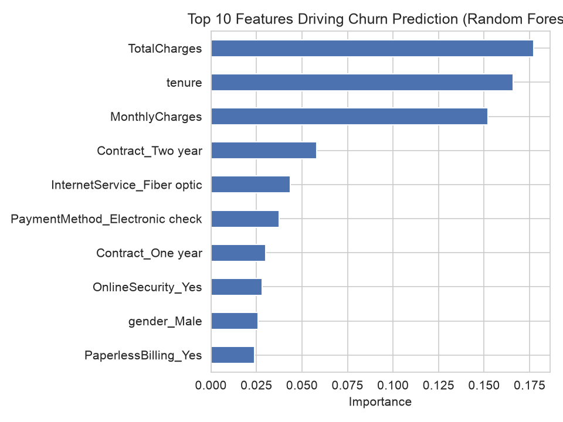

# Customer Churn Prediction & Revenue Analytics

Exploratory analysis and predictive modeling on customer churn, built to identify
churn drivers, quantify revenue at risk, and predict which customers are likely to churn.

## Dataset

[IBM Telco Customer Churn dataset](https://github.com/IBM/telco-customer-churn-on-icp4d) — 7,043 customers, 21 features
(demographics, account info, services subscribed, and churn status).

## Key Findings

- **Overall churn rate: 26.5%**
- **Contract type is the strongest churn driver**: month-to-month customers churn at
  42.7%, vs. 2.8% for two-year contracts — a 15x difference.
- **Churn risk is front-loaded**: customers in their first year churn at 47.7%,
  dropping to 9.5% after 4+ years.
- **Churned customers have *higher* average monthly bills** ($74.44) than retained
  customers ($61.27) — this is a revenue problem, not just a volume problem.
- **30.5% of monthly recurring revenue is currently at risk** from customers likely to churn.
- Fiber optic internet service carries the single largest churn-risk coefficient in the
  logistic regression model — a driver not obvious from univariate analysis alone.

## Models

| Model | ROC-AUC | Recall |
|---|---|---|
| Logistic Regression (class-balanced) | 0.841 | 0.786 |
| Random Forest (class-balanced) | 0.829 | 0.652 |

Class weighting (`class_weight='balanced'`) was used to address the ~73/27 class
imbalance — the default threshold under-predicted churners, which matters more than
overall accuracy for a retention use case.



## Project Structure

```
├── data/               # Raw dataset
├── src/
│   ├── load_data.py    # Data loading
│   ├── clean_data.py   # Cleaning (type fixes, missing value handling)
│   ├── features.py     # One-hot encoding / feature engineering
│   └── train_model.py  # Model training and evaluation
├── notebooks/
│   └── 01_eda.ipynb    # Exploratory analysis, charts, feature importance
├── outputs/            # Saved chart images
└── requirements.txt
```

## Setup

```bash
python3 -m venv venv
source venv/bin/activate
pip install -r requirements.txt
```

## Run

```bash
cd src
python3 load_data.py       # sanity check
python3 clean_data.py      # cleaning summary
python3 features.py        # feature engineering summary
python3 train_model.py     # train + evaluate both models
```

Or explore interactively via `notebooks/01_eda.ipynb`.